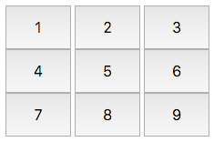
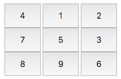

# 

# [Hacker Hank](https://github.com/kakanew/Hacker_Hank)

### [10 Days of Javascript](https://github.com/kakanew/Hacker_Hank/tree/master/10_Days_of_Javascript)

## Day 8: Create a Button

## **Objetivo**

Neste desafio, colocamos os botões dentro de uma *div* e modificamos seus rótulos após cada evento de clique em um dos botões. Confira o tutorial em anexo para materiais de aprendizagem.

## Tarefa

Queremos criar nove botões dentro de uma *div* , dispostos de forma que formem umgrade. Cada botão tem um rótulo distinto de para , e os rótulos nos botões externos devem girar no *sentido horário* cada vez que clicamos no botão do meio.

Complete o código no editor para que ele satisfaça os seguintes critérios:

- *Estado inicial.* O layout inicial é parecido com este:
  



- *IDs de elemento.* Cada elemento do documento deve ter um `id`, especificado abaixo:

  - Os botão recipiente *div* 's `id`deve ser `btns`.
  - Os `innerHTML`rótulos iniciais devem ter os seguintes botões `id`:

  | `innerHTML` | `id`   |
  | ----| ------ |
  | `1` | `btn1` |
  | `2` | `btn2` |
  | `3` | `btn3` |
  | `4` | `btn4` |
  | `5` | `btn5` |
  | `6` | `btn6` |
  | `7` | `btn7` |
  | `8` | `btn8` |
  | `9` | `btn9` |

- *Estilo*. Os elementos do documento devem ter os seguintes estilos:

  - `width`de `btns`é, em relação à largura do corpo do documento.

  - Cada botão (ou seja,`btn1` através `btn9`) satisfaz o seguinte:

    - `width`é, em relação à largura do contêiner.
    - `height`é `48px`.
    - `font-size`é `24px`.
  
- *Comportamento.* Cada vez que `btn5`é clicado, o `innerHTML`texto no exterior botões da grade (ou seja, `btn1`, `btn2`, `btn3`, `btn4`, `btn6`, `btn7`, `btn8`, `btn9`) deve girar no *sentido horário* direção. *Não* atualize o botão `id`.

Os arquivos `.js`e `.css`estão em diretórios diferentes, portanto, use a tag de *link* para fornecer o caminho do arquivo CSS e a tag de *script* para fornecer o caminho do arquivo JS:

```
<!DOCTYPE html>
<html>
    <head>
        <link rel="stylesheet" href="css/buttonsGrid.css" type="text/css">
    </head>
    
    <body>
    	<script src="js/buttonsGrid.js" type="text/javascript"></script>
    </body>
</html>
```

## **Explicação**

Inicialmente, os botões têm a seguinte aparência:


Depois de clicar `btn5` vez, eles se parecem com isto:



Depois de clicar `btn5` mais tempo (para um total de cliques), eles têm a seguinte aparência:


### [Hacker Hank](https://github.com/kakanew/Hacker_Hank)

