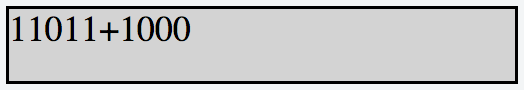

# 

# [Hacker Hank](https://github.com/kakanew/Hacker_Hank)

### [10 Days of Javascript](https://github.com/kakanew/Hacker_Hank/tree/master/10_Days_of_Javascript)

## Day 9: Binary Calculator

## **Objetivo**

Neste desafio, implementamos uma calculadora que usa números binários. 

## **Tarefa**

Implemente uma calculadora simples que execute as seguintes operações em *números binários* : adição, subtração, multiplicação e divisão. Observe que a operação de divisão deve ser apenas uma *divisão inteira* ; por exemplo,, , e .

O estado inicial da calculadora deve ser assim:


- *IDs de elemento. Cada elemento do documento deve ter um `id`, especificado abaixo:*

  | `innerHTML` | `id`     | Descrição / Comportamento                                    |
  | ----------- | -------- | ------------------------------------------------------------ |
  |             | `res`    | Contém o resultado dos pressionamentos de botão.             |
  |             | `btns`   | Um recipiente de botão que exibe todos os oito botões da calculadora. |
  | `0`         | `btn0`   | Um botão que expressa o dígito binário .                     |
  | `1`         | `btn1`   | Um botão que expressa o dígito binário .                     |
  | `C`         | `btnClr` | Um botão para limpar o conteúdo de .                         |
  | `=`         | `btnEql` | Um botão para avaliar o conteúdo da expressão em .           |
  | `+`         | `btnSum` | Um botão para a operação de adição.                          |
  | `-`         | `btnSub` | Um botão para a operação de subtração.                       |
  | `*`         | `btnMul` | Um botão para a operação de multiplicação.                   |
  | `/`         | `btnDiv` | Um botão para a operação de divisão inteira.                 |

- *Estilo.* Os elementos do documento devem ter os seguintes estilos:

  - `body`tem um `width`de `33%`.
  - `res`tem um `background-color`de `lightgray`, um `border`isto é `solid`, um `height`de `48px`e um `font-size`de `20px`.
  - `btn0`e `btn1`tem um `background-color`de `lightgreen`e um `color`de `brown`.
  - `btnClr`e `btnEql`tem um `background-color`de `darkgreen`e um `color`de `white`.
  - `btnSum`, `btnSub`, `btnMul`, E `btnDiv`têm um `background-color`de `black`, um `color`dos `red`.
  - Todos os botões em `btns`ter um `width`de `25%`, um `height`de `36px`, um `font-size`de `18px`, `margin`de `0px`, e `float`valor `left`.

Os arquivos `.js`e `.css`estão em diretórios diferentes, portanto, use a tag de *link* para fornecer o caminho do arquivo CSS e a tag de *script* para fornecer o caminho do arquivo JS:

```
<! DOCTYPE html> 
< html > 
    < head > 
        < link  rel = "stylesheet"  href = "css / binaryCalculator.css"  type = "text / css" > 
    </ head >
    
    < body > 
    	< script  src = "js / binaryCalculator.js"  type = "text / javascript" > </ script > 
    </ body > 
</ html >
```

## **Restrições**

- Todas as expressões no conjunto de dados de teste são inseridas no formulário , Onde é o primeiro número binário, é o segundo número binário, e está no set .
- Ambos os operandos serão sempre inteiros positivos quando convertidos de base basear-.
- Todas as expressões serão válidas.

## **Explicação**

Considere a seguinte sequência de cliques de botão:


Antes de pressionar o botão, o *div de* resultado é parecido com este:



Depois de pressionar o botão para avaliar nossa expressão, o resultado *div* é parecido com este:


Notar que , , e , então nossa calculadora avaliou a expressão corretamente.

Agora, vamos considerar nossa próxima sequência de cliques de botão como:


Antes de pressionar o botão, o *div de* resultado é parecido com este:


Depois de pressionar o botão para avaliar nossa expressão, o resultado *div* é parecido com este:


Considere a próxima sequência de cliques de botão como:


O resultado *div* é parecido com este:


### [Hacker Hank](https://github.com/kakanew/Hacker_Hank)

