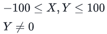
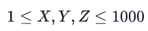

# 

# [Hacker Hank](https://github.com/kakanew/Hacker_Hank)

### Linux Shell

# Let's Echo

Escreva um script de bash que imprime a string "HELLO".

**Formato de entrada**

Não há nenhum arquivo de entrada necessário para este problema.

**Formato de saída**

HELLO

**Saída de amostra**

HELLO

------

# Looping and Skipping

Sua tarefa é usar *loops para* exibir apenas números naturais *ímpares* de **199**.

**Formato de saída**

```
1
3
5
.
.
.
.
.
99  
```

**Saída de amostra**

```
1
3
5
.
.
.
.
.
99  
```

------


# Looping with Numbers

Sua tarefa é usar *loops para* exibir apenas números naturais *ímpares* de 199.

**Formato de saída**

```
1
3
5
.
.
.
.
.
99
```

**Saída de amostra**

```
1
3
5
.
.
.
.
.
99 
```

------

# A Personalized Echo

Escreva um script Bash que aceita *name* como entrada e exibe a saudação "Bem-vindo (nome)"

**Formato de entrada**

Há uma linha de texto, *name*.

**Formato de saída**

Uma linha:  "Welcome (name)" (aspas excluídas).
A avaliação será sensível ao caso.

**Entrada da amostra 0**

```
Dan 
```

**Saída da amostra 0**

```
Welcome Dan  
```

**Entrada da amostra 1**

```
Prashant
```

**Saída da amostra 1**

```
Welcome Prashant
```

------


# Looping with Numbers

Use um loop *para* exibir os números naturais de **150.**

**Formato de saída**

```
1
2
3
4
5
.
.
.
.
.
50
```

------

# The World of Numbers

Dado dois inteiros, e , encontrar sua soma, diferença, produto e quociente.

**Formato de entrada**

Duas linhas contendo um inteiro cada ( e, respectivamente, )**. XY**

**Restrições**



**Formato de saída**

Quatro linhas contendo a soma (X + Y), diferença (X - Y), produto (X x Y), e quociente (X / Y), respectivamente.
(Ao calcular o quociente, imprima apenas a parte inteiro.)

**Entrada de amostra**

```
5
2
```

**Saída de amostra**

```
7
3
10
2
```

**Explicação**

5 + 2
= 7 5
\- 2 = 3
5 * 2 = 10 5 / 2 = 2 (parte inteiro)

------

# Comparing Numbers

Dado dois inteiros, e , identificar se XYX < Y ou X > Y ou X = Y.

Exatamente uma das
seguintes linhas: - *X é menor que Y*
\- X é maior que *Y*
\- *X é igual a Y*

**Formato de entrada**

Duas linhas contendo um inteiro cada ( e, respectivamente, ). XY

**Formato de saída**

Exatamente uma das
seguintes linhas: - *X é menor que Y*
\- X é maior que *Y*
\- *X é igual a Y*

**Entrada da amostra 1**

```
5  
2  
```

**Entrada da amostra 2**

```
2
2  
```

**Entrada da amostra 3**

```
2
3  
```

**Saída da amostra 1**

```
X is greater than Y  
```

**Saída da amostra 2**

```
X is equal to Y   
```

**Saída da amostra 3**

```
X is less than Y  
```

------

# Getting started with conditionals

Leia em um personagem do STDIN.
Se o personagem for 'Y' ou 'y' exibir "SIM".
Se o caractere for 'N' ou 'n' exibir "NÃO".
Nenhum outro personagem será fornecido como entrada.

**Formato de entrada**

Um personagem

**Restrições**

O personagem será do set **{yYnN}.**

eco ou para STDOUT.`YES` `NO`

**Entrada de amostra**

```
y  
```

**Saída de amostra**

```
YES
```

------

# More on Conditionals

Dado três inteiros (, e ) representando os três lados de um triângulo, identifique se o triângulo é scalene, isósceles ou equilateral. XYZ

- Se os três lados forem iguais, saída . `EQUILATERAL`
- Caso contrário, se algum dos dois lados for igual, saída . `ISOSCELES`
- Caso contrário, saída . `SCALENE`

**Formato de entrada**

Três inteiros, cada um em uma nova linha.

**Restrições**


A soma de qualquer dois lados será maior que a terceira.

**Formato de saída**

Uma palavra: "SCALENE" ou "EQUILATERAL" ou "ISOSCELES" (aspas excluídas).

**Entrada da amostra 1**

```
2
3
4
```

**Entrada da amostra 2**

```
6
6
6  
```

**Saída de amostra**

**Saída da amostra 1**

```
SCALENE
```

**Saída da amostra 2**

```
EQUILATERAL  
```

### [Hacker Hank](https://github.com/kakanew/Hacker_Hank)

