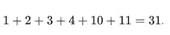
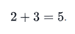

# 

# [Hacker Hank](https://github.com/kakanew/Hacker_Hank)

### Problem Solving

# Simple Array Sum

Dado um array de inteiros, encontre a soma de seus elementos.

Por exemplo, se a matriz , então  volte 6

## **Descrição da função**

Conclua a função *simpleArraySum* no editor abaixo. Ele deve retornar a soma dos elementos da matriz como um inteiro.

simpleArraySum tem o (s) seguinte (s) parâmetro (s):

- *ar* : uma matriz de inteiros

## **Formato de entrada**

A primeira linha contém um inteiro, , denotando o tamanho da matriz.
A segunda linha contém inteiros separados por espaço que representam os elementos da matriz.

## **Restrições**


## **Formato de saída**

Imprime a soma dos elementos da matriz como um único inteiro.

## **Amostra de entrada**

```
6
1 2 3 4 10 11
```

## **Saída de amostra**

```
31
```

## **Explicação**

Imprimimos a soma dos elementos da matriz: 



------

# Solve Me First

Complete a função *solveMeFirst* para calcular a soma de dois inteiros.

**Exemplo**


Retornar 10.

## **Descrição da função**

Conclua a função *solveMeFirst* no editor abaixo.

*solveMeFirst* tem os seguintes parâmetros:

- *int a* : o primeiro valor
- *int b* : o segundo valor

Retorna
\- *int* : a soma de`a` e `b`

## **Restrições**


## **Amostra de entrada**

```
a = 2
b = 3
```

## **Saída de amostra**

```
5
```

## **Explicação**



------


### [Hacker Hank](https://github.com/kakanew/Hacker_Hank)